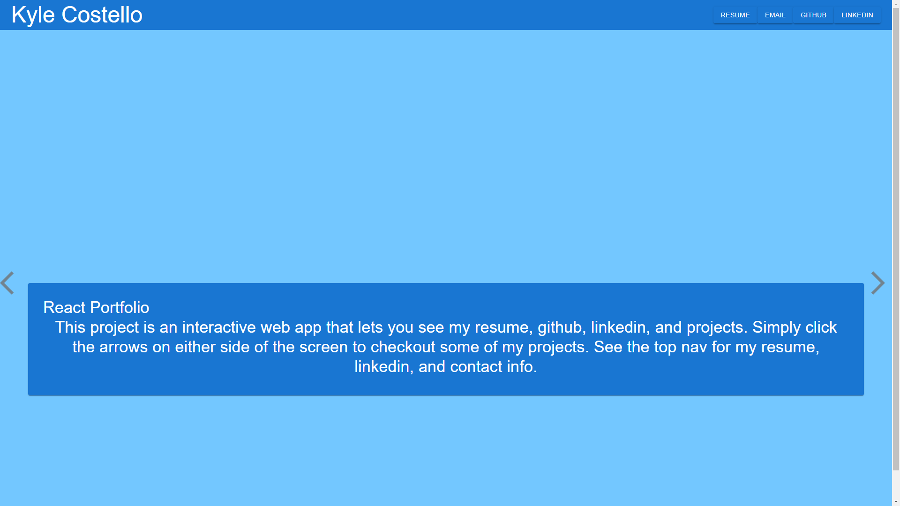

 
# React Portfolio
## Description
I needed a way to display all my projects at once. This website displays several of my projects with contact data, so that potential employers can view them with ease.
## Table of Contents
- #### [Description](##-description)
- #### [Installation](##-Installation)
- #### [License](##-license)
- #### [Questions](##-questions)

## Installation
Please visit the deployment on GitHub [Here](https://krestle80.github.io/reactPortfolio/)

## License
Copyright  2022  Kyle Costello
 
 Licensed under the Apache License, Version 2.0 (the "License");
 you may not use this file except in compliance with the License.
 You may obtain a copy of the License at
 
 http://www.apache.org/licenses/LICENSE-2.0
 
 Unless required by applicable law or agreed to in writing, software
 distributed under the License is distributed on an "AS IS" BASIS,
 WITHOUT WARRANTIES OR CONDITIONS OF ANY KIND, either express or implied.
 See the License for the specific language governing permissions and
 limitations under the License.
## Questions
If you have any questions regarding this project please feel free to reach out at 

-Email: kylec0217@gmail.com 
-GitHub Username: krestle80 
